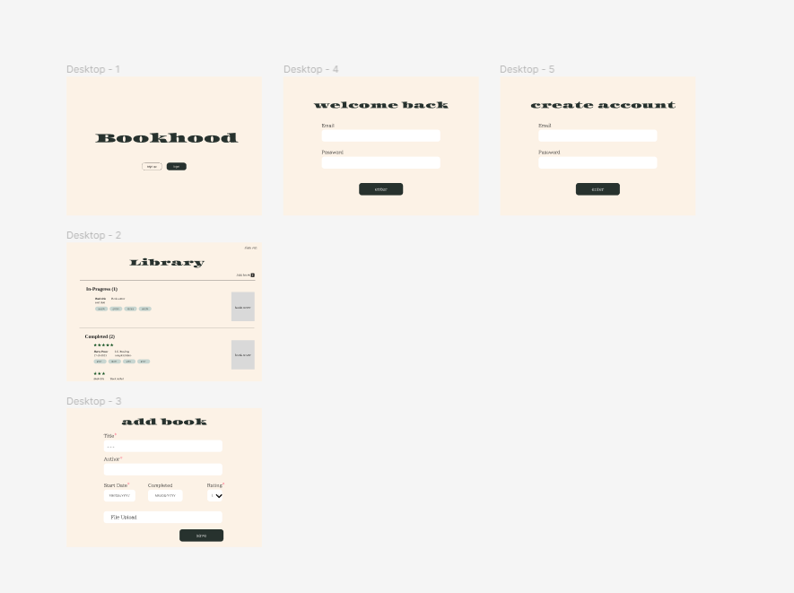
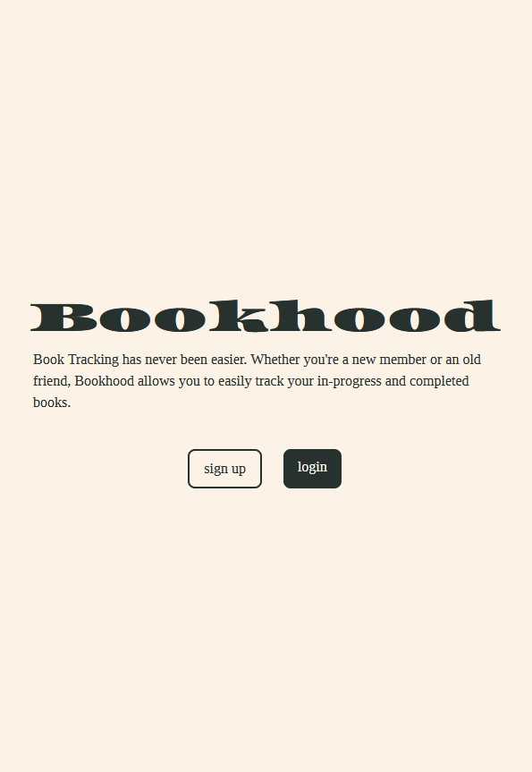
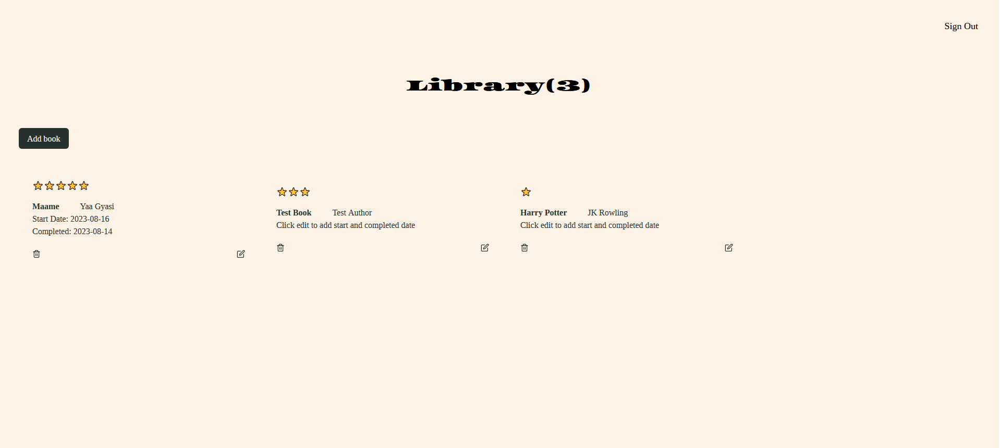
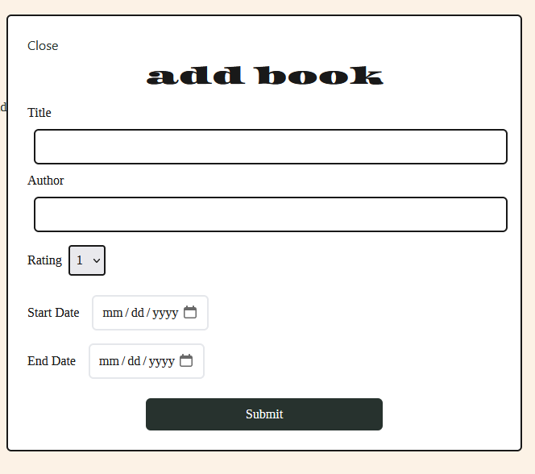

# Bookhood 
Book tracking should be easy to use and easy to understand. Bookhood invites users to create their own little neighborhood of personalized book lists.

## Languages, Framework, Software used 


## Inspiration 
This past year I've been rekindling my love for books. I have increased the number of books I'm reading and I follow content creators who vlog and stream their own reading journeys. After researching present competitors such as Bookshelf, Basmo, and Italic Type, I wanted to present my own version of a book tracking app that creates a cozy atmosphere.

## Design 
Before I started programming, I first designed a wireframe to layout the design and the look I wanted to go for.
)

Using color contrast testers, I intentionally chose a natural color palette. Natural colors such as brown and green are soothing to look at. I felt they would enhance the overall feel and aesthetic of the application.


I chose to pair a fat serif font, Asset, with another serif font, Tinos. I felt the font pairing added simplicity and a level of intelligence to the design. The contrast was very interesting to look at.

Below features an alternative look I initially pictured for iOs and Android applications if I extended to mobile development in React Native at a later time.


## Features 
- Authentication: Users can choose to create an account or they can login into a pre-existing account. The books they add are saved under their user id.

- Private pages: If a user is not logged in, they are unable to access the library page to view book lists.

- Authenticated users can add books to their list. Lists are saved in the Firestore database, logging the book, author, and rating given by the logged in user.

- Responsive Web Design 

## Visuals
Homepage on the desktop version, small screen: 



The library displays the number of books currently saved. It displays the rating, title, author, start and completed dates if added. If the user leaves the dates blank they are prompted to click edit in order to add the dates. 



When a user is ready to add a new book to their library, they can click add book. They are then shown a dialog box that prompts them to input information about their new book. 




## Installation 
To install the project on your local environment, first make sure you have an account on Google's Firebase platform. 

Reference this [documentation](https://firebase.google.com/docs/web/setup) for step by step guide on setting up your project.

Next, open up the terminal and type ```npm install``` in the client directory to install the project dependencies. 

Once the project is set up, create a .env file in the root folder and save the keys with the VITE prefix. Ex. ```VITE_PUBLIC_KEY``` 

With vite, you can expose .env variables using ```import.meta.env.VITE_KEY_NAME_HERE```.

Read more about on Vite's [website](https://vitejs.dev/guide/env-and-mode.html).

Type ```npm run dev``` in the terminal to start the vite server. Live updates will appear as you make changes to the files.

